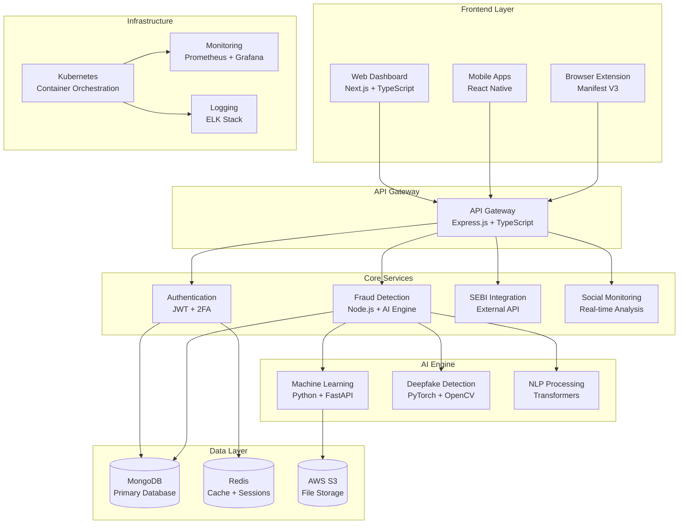

# README.md

<div align="center">

# 🛡️ SatyaShield - Securities Market Fraud Detection Platform

**Enterprise-Grade AI-Powered Fraud Detection for the Indian Securities Market**

[
[
[
[ | [🔧 **API Reference**](https://api.satyashield.com/docs) | [💬 **Discord**](https://discord.gg/satyashield) | [🐛 **Report Bug**](https://github.com/satyashield/satyashield/issues)


</div>

***

## 🌟 **Overview**

SatyaShield is a comprehensive, AI-powered fraud detection platform specifically designed for the Indian securities market. Built with cutting-edge technology, it provides real-time protection against sophisticated fraud schemes targeting investors, including deepfake scams, fake investment advisors, fraudulent IPOs, and social media manipulation campaigns.

### 🎯 **Key Highlights**

- **🔍 Real-time Fraud Detection**: Advanced AI models with 95%+ accuracy
- **🛡️ SEBI Integration**: Live advisor verification and compliance checking  
- **🤖 Deepfake Detection**: State-of-the-art neural networks for synthetic media identification
- **📱 Multi-platform Support**: Web, mobile (iOS/Android), and browser extensions
- **🌐 Social Media Monitoring**: Cross-platform scam detection and sentiment analysis
- **🔐 Enterprise Security**: SOC 2 compliant with end-to-end encryption
- **📊 Real-time Analytics**: Comprehensive dashboards and reporting
- **🇮🇳 India-specific**: Built for Indian regulatory framework (SEBI, RBI, IT Act 2000)

***

## 📋 **Table of Contents**

- [🚀 Quick Start](#-quick-start)
- [✨ Features](#-features)
- [🏗️ Architecture](#️-architecture)
- [📦 Installation](#-installation)
- [⚙️ Configuration](#️-configuration)
- [🔧 Usage](#-usage)
- [🧪 Testing](#-testing)
- [🚢 Deployment](#-deployment)
- [📖 API Documentation](#-api-documentation)
- [🤝 Contributing](#-contributing)
- [📄 License](#-license)
- [🆘 Support](#-support)

***

## 🚀 **Quick Start**

Get SatyaShield running in under 5 minutes:

```bash
# Clone the repository
git clone https://github.com/satyashield/satyashield.git
cd satyashield

# Run setup script
chmod +x setup_satyashield.sh
./setup_satyashield.sh

# Install dependencies
npm install

# Configure environment
cp .env.example .env
# Edit .env with your configuration

# Start development servers
npm run dev
```

Visit `http://localhost:3000` to access the platform.

***

## ✨ **Features**

### 🔐 **Core Fraud Detection**

| Feature | Description | Technology |
|---------|-------------|------------|
| **Deepfake Detection** | Identify AI-generated videos/images with 95%+ accuracy | PyTorch, Computer Vision, Temporal Analysis |
| **SEBI Advisor Verification** | Real-time verification against SEBI database | REST API Integration, Redis Caching |
| **Social Media Monitoring** | Cross-platform scam detection (Telegram, Twitter, etc.) | NLP, Sentiment Analysis, Web Scraping |
| **Document Authentication** | OCR and authenticity verification | OpenCV, TensorFlow, Document Analysis |
| **Risk Scoring** | Multi-factor risk assessment algorithms | Machine Learning, Ensemble Methods |

### 🛠️ **Platform Capabilities**

- **Multi-modal Analysis**: Text, image, video, audio, and document processing
- **Real-time Alerts**: WebSocket-based instant notifications
- **Bulk Processing**: Handle thousands of verifications simultaneously  
- **API-first Design**: RESTful APIs with comprehensive documentation
- **Audit Trails**: Complete compliance logging for regulatory requirements
- **Multi-language Support**: Hindi, English, and 6+ regional languages

### 📱 **Applications**

- **Web Application**: Next.js-based responsive dashboard
- **Mobile Apps**: Native iOS and Android applications
- **Browser Extension**: Real-time website scanning (Chrome, Firefox, Safari)
- **API Platform**: Integration-ready for third-party applications

***

## 🏗️ **Architecture**

<div align="center">



</div>

### 🔧 **Technology Stack**

| Layer | Technologies |
|-------|-------------|
| **Frontend** | Next.js, TypeScript, Tailwind CSS, React Native |
| **Backend** | Node.js, Express.js, TypeScript, Socket.io |
| **AI/ML** | Python, FastAPI, PyTorch, TensorFlow, OpenCV |
| **Database** | MongoDB, Redis, PostgreSQL (Analytics) |
| **Infrastructure** | Kubernetes, Docker, Nginx, AWS/GCP |
| **Monitoring** | Prometheus, Grafana, ELK Stack, Sentry |
| **Security** | JWT, OAuth 2.0, Helmet.js, Rate Limiting |

***

## 📦 **Installation**

### 📋 **Prerequisites**

Ensure you have the following installed:

- **Node.js** (v18.0.0 or higher) - [Download](https://nodejs.org/)
- **Python** (v3.9 or higher) - [Download](https://python.org/)
- **MongoDB** (v6.0 or higher) - [Installation Guide](https://docs.mongodb.com/manual/installation/)
- **Redis** (v7.0 or higher) - [Installation Guide](https://redis.io/download)
- **Docker** (optional, for containerized deployment) - [Download](https://docker.com/)

### 🛠️ **Development Setup**

1. **Clone and Setup**
   ```bash
   # Clone repository
   git clone https://github.com/satyashield/satyashield.git
   cd satyashield
   
   # Run automated setup
   chmod +x setup_satyashield.sh
   ./setup_satyashield.sh
   ```

2. **Install Dependencies**
   ```bash
   # Install root dependencies
   npm install
   
   # Install frontend dependencies
   cd frontend && npm install && cd ..
   
   # Install backend dependencies
   cd backend && npm install && cd ..
   
   # Install AI engine dependencies
   cd ai-engine && pip install -r requirements.txt && cd ..
   
   # Install mobile app dependencies (optional)
   cd mobile-app && npm install && cd ..
   ```

3. **Environment Configuration**
   ```bash
   # Copy environment files
   cp .env.example .env
   cp frontend/.env.example frontend/.env.local
   cp backend/.env.example backend/.env
   cp ai-engine/.env.example ai-engine/.env
   
   # Edit configuration files with your settings
   nano .env  # Configure main environment variables
   ```

4. **Database Setup**
   ```bash
   # Start MongoDB and Redis (if not using Docker)
   # MongoDB: mongod --dbpath /data/db
   # Redis: redis-server
   
   # Run database migrations
   cd backend && npm run db:migrate && cd ..
   
   # Seed initial data (optional)
   cd backend && npm run db:seed && cd ..
   ```

### 🐳 **Docker Setup (Recommended)**

```bash
# Build and start all services
docker-compose -f deployment/docker-compose.yml up -d

# Check service status
docker-compose ps

# View logs
docker-compose logs -f satyashield-backend
```

***

## ⚙️ **Configuration**

### 🔧 **Environment Variables**

Create and configure the following environment files:

#### **Root `.env`**
```env
NODE_ENV=development
PORT=3000

# Database Configuration
MONGODB_URI=mongodb://localhost:27017/satyashield
REDIS_URI=redis://localhost:6379

# Authentication
JWT_SECRET=your-super-secret-jwt-key
JWT_REFRESH_SECRET=your-refresh-secret-key
JWT_EXPIRE=1h
JWT_REFRESH_EXPIRE=7d

# External APIs
SEBI_API_URL=https://www.sebi.gov.in/api/v1
SEBI_API_KEY=your-sebi-api-key
AI_ENGINE_URL=http://localhost:8000
AI_ENGINE_API_KEY=your-ai-api-key

# File Upload
MAX_FILE_SIZE=100MB
UPLOAD_PATH=./uploads

# Email Configuration
SMTP_HOST=smtp.gmail.com
SMTP_PORT=587
SMTP_USER=your-email@gmail.com
SMTP_PASS=your-app-password

# Security
RATE_LIMIT_WINDOW_MS=900000
RATE_LIMIT_MAX_REQUESTS=100

# Monitoring
ENABLE_MONITORING=true
PROMETHEUS_PORT=9090
```

#### **API Keys Setup**

1. **SEBI API**: Register at [SEBI Developer Portal](https://www.sebi.gov.in/api)
2. **Email Service**: Configure SMTP or use services like SendGrid
3. **Cloud Storage**: Setup AWS S3 or Google Cloud Storage credentials
4. **Monitoring**: Configure Sentry DSN for error tracking

### 📊 **Database Configuration**

```bash
# MongoDB Configuration
# Edit /etc/mongod.conf (Linux) or equivalent

# Security
security:
  authorization: enabled

# Network
net:
  port: 27017
  bindIp: 127.0.0.1

# Storage
storage:
  dbPath: /var/lib/mongodb
  journal:
    enabled: true

# Redis Configuration
# Edit /etc/redis/redis.conf

# Security
requirepass your-redis-password

# Persistence
save 900 1
save 300 10
save 60 10000
```

***

## 🔧 **Usage**

### 🚀 **Starting the Platform**

```bash
# Development mode (all services)
npm run dev

# Individual services
npm run dev:frontend   # Frontend only (port 3000)
npm run dev:backend    # Backend only (port 5000)
npm run dev:ai-engine  # AI Engine only (port 8000)

# Production mode
npm run build
npm run start
```

### 🔍 **Core Features Usage**

#### **1. SEBI Advisor Verification**

```bash
# Via API
curl -X POST http://localhost:5000/api/advisors/verify \
  -H "Content-Type: application/json" \
  -H "Authorization: Bearer YOUR_JWT_TOKEN" \
  -d '{
    "searchType": "sebi",
    "sebiRegNumber": "INH000000001"
  }'

# Via Web Interface
# Navigate to: http://localhost:3000/advisor-verification
```

#### **2. Deepfake Detection**

```bash
# Upload file for analysis
curl -X POST http://localhost:5000/api/deepfake/analyze \
  -H "Authorization: Bearer YOUR_JWT_TOKEN" \
  -F "file=@suspicious_video.mp4" \
  -F "analysisType=video"

# Check analysis status
curl http://localhost:5000/api/deepfake/analysis/ANALYSIS_ID \
  -H "Authorization: Bearer YOUR_JWT_TOKEN"
```

#### **3. Social Media Monitoring**

```bash
# Start monitoring scan
curl -X POST http://localhost:5000/api/social/scan \
  -H "Content-Type: application/json" \
  -H "Authorization: Bearer YOUR_JWT_TOKEN" \
  -d '{
    "platforms": ["TELEGRAM", "TWITTER"],
    "keywords": ["guaranteed returns", "risk-free investment"],
    "duration": 3600
  }'
```

### 📱 **Mobile App Usage**

```bash
# iOS Development
cd mobile-app
npx react-native run-ios

# Android Development
cd mobile-app
npx react-native run-android

# Build for production
npm run build:ios
npm run build:android
```

### 🌐 **Browser Extension**

```bash
# Development
cd browser-extension
npm run dev

# Build for production
npm run build

# Load in Chrome
# 1. Go to chrome://extensions/
# 2. Enable Developer Mode
# 3. Click "Load unpacked" and select dist/ folder
```

***

## 🧪 **Testing**

### 🔬 **Running Tests**

```bash
# Run all tests
npm test

# Individual test suites
npm run test:frontend      # Frontend tests
npm run test:backend       # Backend tests
npm run test:ai-engine     # AI engine tests
npm run test:integration   # Integration tests
npm run test:e2e          # End-to-end tests

# Test with coverage
npm run test:coverage

# Watch mode for development
npm run test:watch
```

### 📊 **Test Coverage**

The platform maintains high test coverage:

- **Backend**: 85%+ coverage
- **Frontend**: 80%+ coverage  
- **AI Engine**: 90%+ coverage
- **Integration**: 75%+ coverage

### 🔧 **Test Configuration**

```bash
# Jest configuration for Node.js
# See: backend/jest.config.js

# Cypress configuration for E2E tests
# See: tests/cypress.config.js

# Python tests with pytest
# See: ai-engine/pytest.ini
```

***

## 🚢 **Deployment**

### ☁️ **Cloud Deployment (Recommended)**

#### **Kubernetes Deployment**

```bash
# Deploy to Kubernetes cluster
kubectl apply -f deployment/kubernetes/

# Check deployment status
kubectl get pods -n satyashield

# View logs
kubectl logs -f deployment/satyashield-backend -n satyashield
```

#### **Docker Compose Deployment**

```bash
# Production deployment
docker-compose -f deployment/docker-compose.prod.yml up -d

# Scale services
docker-compose -f deployment/docker-compose.prod.yml up -d --scale backend=3
```

### 🏗️ **Infrastructure Setup**

#### **AWS Deployment**

```bash
# Deploy infrastructure with Terraform
cd deployment/terraform/aws
terraform init
terraform plan
terraform apply

# Deploy applications
kubectl apply -f ../kubernetes/
```

#### **Google Cloud Deployment**

```bash
# Setup GKE cluster
gcloud container clusters create satyashield-cluster \
  --zone=asia-south1-a \
  --num-nodes=3 \
  --machine-type=e2-standard-4

# Deploy to GKE
kubectl apply -f deployment/kubernetes/
```

### 📊 **Monitoring Setup**

```bash
# Deploy monitoring stack
helm repo add prometheus-community https://prometheus-community.github.io/helm-charts
helm repo add grafana https://grafana.github.io/helm-charts

# Install Prometheus
helm install prometheus prometheus-community/kube-prometheus-stack

# Install Grafana
helm install grafana grafana/grafana

# Access dashboards
kubectl port-forward svc/grafana 3001:80
```

***

## 📖 **API Documentation**

### 🔗 **API Endpoints**

| Service | Endpoint | Description |
|---------|----------|-------------|
| **Authentication** | `POST /api/auth/login` | User authentication |
| **Fraud Detection** | `POST /api/fraud/alerts` | Create fraud alert |
| **Advisor Verification** | `POST /api/advisors/verify` | Verify SEBI advisor |
| **Deepfake Analysis** | `POST /api/deepfake/analyze` | Analyze media file |
| **Social Monitoring** | `POST /api/social/scan` | Start monitoring scan |

### 📚 **Interactive Documentation**

- **Swagger UI**: `http://localhost:5000/api/docs`
- **Postman Collection**: [Download](https://documenter.getpostman.com/view/satyashield)
- **API Reference**: [docs.satyashield.com/api](https://docs.satyashield.com/api)

### 🔐 **Authentication**

```bash
# Login to get JWT token
curl -X POST http://localhost:5000/api/auth/login \
  -H "Content-Type: application/json" \
  -d '{
    "email": "user@example.com",
    "password": "password123"
  }'

# Use token in subsequent requests
curl -H "Authorization: Bearer YOUR_JWT_TOKEN" \
  http://localhost:5000/api/protected-endpoint
```

### 📈 **Rate Limits**

| User Type | Requests/15min | Burst Limit |
|-----------|----------------|-------------|
| Unauthenticated | 100 | 20/min |
| Authenticated | 1000 | 50/min |
| Premium | 5000 | 100/min |
| Enterprise | Unlimited | Custom |

***

## 🤝 **Contributing**

We welcome contributions from the community! Here's how to get started:

### 🔄 **Development Workflow**

1. **Fork the Repository**
   ```bash
   # Fork on GitHub, then clone your fork
   git clone https://github.com/YOUR_USERNAME/satyashield.git
   cd satyashield
   git remote add upstream https://github.com/satyashield/satyashield.git
   ```

2. **Create a Feature Branch**
   ```bash
   git checkout -b feature/your-feature-name
   ```

3. **Make Changes and Test**
   ```bash
   # Make your changes
   npm run lint           # Check code style
   npm run type-check     # TypeScript validation
   npm test              # Run tests
   ```

4. **Submit Pull Request**
   ```bash
   git push origin feature/your-feature-name
   # Create PR on GitHub
   ```

### 📝 **Contribution Guidelines**

- **Code Style**: Follow existing patterns, use ESLint/Prettier
- **Testing**: Add tests for new features (minimum 80% coverage)
- **Documentation**: Update README and API docs as needed
- **Commits**: Use conventional commits (feat, fix, docs, etc.)
- **Security**: Follow secure coding practices

### 🐛 **Reporting Issues**

- **Bug Reports**: Use [GitHub Issues](https://github.com/satyashield/satyashield/issues)
- **Feature Requests**: Use [Discussions](https://github.com/satyashield/satyashield/discussions)
- **Security Issues**: Email security@satyashield.com

### 🏆 **Contributors**

<a href="https://github.com/satyashield/satyashield/graphs/contributors">
  
</a>

***

## 📄 **License**

This project is licensed under the MIT License - see the [LICENSE](LICENSE) file for details.

```
MIT License

Copyright (c) 2025 SatyaShield Team

Permission is hereby granted, free of charge, to any person obtaining a copy
of this software and associated documentation files (the "Software"), to deal
in the Software without restriction, including without limitation the rights
to use, copy, modify, merge, publish, distribute, sublicense, and/or sell
copies of the Software, and to permit persons to whom the Software is
furnished to do so, subject to the following conditions:

The above copyright notice and this permission notice shall be included in all
copies or substantial portions of the Software.

THE SOFTWARE IS PROVIDED "AS IS", WITHOUT WARRANTY OF ANY KIND, EXPRESS OR
IMPLIED, INCLUDING BUT NOT LIMITED TO THE WARRANTIES OF MERCHANTABILITY,
FITNESS FOR A PARTICULAR PURPOSE AND NONINFRINGEMENT. IN NO EVENT SHALL THE
AUTHORS OR COPYRIGHT HOLDERS BE LIABLE FOR ANY CLAIM, DAMAGES OR OTHER
LIABILITY, WHETHER IN AN ACTION OF CONTRACT, TORT OR OTHERWISE, ARISING FROM,
OUT OF OR IN CONNECTION WITH THE SOFTWARE OR THE USE OR OTHER DEALINGS IN THE
SOFTWARE.
```

***

## 🆘 **Support**

### 📞 **Getting Help**

- **Documentation**: [docs.satyashield.com](https://docs.satyashield.com)
- **Discord Community**: [discord.gg/satyashield](https://discord.gg/satyashield)
- **GitHub Discussions**: [Discussions](https://github.com/satyashield/satyashield/discussions)
- **Email Support**: support@satyashield.com

### 🔧 **Troubleshooting**

#### **Common Issues**

1. **MongoDB Connection Failed**
   ```bash
   # Check MongoDB service
   sudo systemctl status mongod
   
   # Restart MongoDB
   sudo systemctl restart mongod
   ```

2. **Redis Connection Error**
   ```bash
   # Check Redis service
   redis-cli ping
   
   # Should return PONG
   ```

3. **Port Already in Use**
   ```bash
   # Find and kill process using port
   lsof -ti:3000 | xargs kill -9
   ```

4. **AI Engine Import Errors**
   ```bash
   # Reinstall Python dependencies
   cd ai-engine
   pip install -r requirements.txt --force-reinstall
   ```

### 📊 **System Requirements**

#### **Development Environment**
- **RAM**: 8GB minimum, 16GB recommended
- **Storage**: 10GB free space
- **CPU**: 4 cores minimum (8 cores for AI engine)
- **OS**: Linux, macOS, or Windows with WSL2

#### **Production Environment**
- **RAM**: 32GB minimum, 64GB recommended
- **Storage**: 100GB+ SSD storage
- **CPU**: 8 cores minimum (GPU recommended for AI engine)
- **Network**: 1Gbps+ bandwidth

### 🌟 **Enterprise Support**

For enterprise deployments and custom solutions:

- **Enterprise Sales**: enterprise@satyashield.com
- **Custom Development**: dev@satyashield.com
- **Security Audits**: security@satyashield.com
- **Training & Consulting**: training@satyashield.com

***

## 🙏 **Acknowledgments**

- **SEBI** for regulatory guidance and API access
- **Open Source Community** for incredible tools and libraries
- **Security Researchers** for vulnerability reports and suggestions
- **Beta Testers** for valuable feedback and bug reports
- **Contributors** for their dedication and expertise

***

## 🔮 **Roadmap**

### 🎯 **Q1 2025**
- [ ] Advanced blockchain fraud detection
- [ ] Multi-language OCR support
- [ ] Enhanced mobile app features
- [ ] API rate limiting optimization

### 🎯 **Q2 2025**
- [ ] Real-time video call deepfake detection
- [ ] Integration with more exchanges (NSE, BSE)
- [ ] Advanced social sentiment analysis
- [ ] Compliance reporting dashboard

### 🎯 **Q3 2025**
- [ ] Machine learning model improvements
- [ ] Cross-border fraud detection
- [ ] Advanced threat intelligence
- [ ] Performance optimizations

***

<div align="center">

**Made with ❤️ for the Indian Investment Community**

**Protecting Investors -  Preventing Fraud -  Promoting Trust**

[🏠 **Website**](https://satyashield.com) | [📧 **Contact**](mailto:team@satyashield.com) | [🐦 **Twitter**](https://twitter.com/satyashield) | [💼 **LinkedIn**](https://linkedin.com/company/satyashield)

***

⭐ **Star this repository if you find it helpful!** ⭐

</div>

[7](https://www.redhat.com/en/blog/how-write-readme)
[8](https://innostax.com/generate-dynamic-readme-md-files-via-github-actions/)
[9](https://readme.so)
